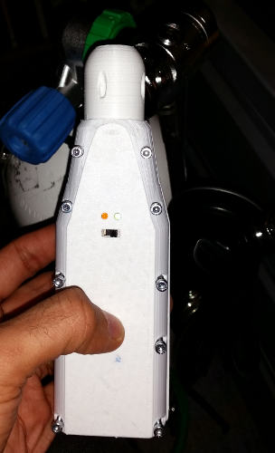

# NitroxAnalyzer
This repository contains everything needed to build a nitrox analyzer that uses a compatible R17 O2 cell and that connects to a mobile phone running on Android.

The finished product:

Read [the wiki page](https://github.com/sergio-alves/NitroxAnalyzer/wiki) to get more information about the project.

