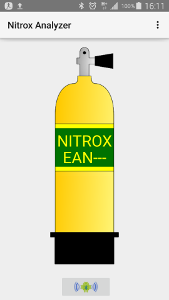

# Nitrox Analyzer for Android

Because i'm a scubadiver, I decided to create a simple
device to read the O2 concentration of gas blends that I
breath.

I created a first version of the device using a screen
and two buttons. It worked, but someone suggested me another idea :

Why not replace the screen and buttons by an Android
application?

Benefits : Better and easy UI, less electronics, and allows me
to show that I can create an Android application that gets
data from an electronic device through a bluetooth connection.

And.... tada!!!

## How it works

If automatic mode (see Settings), at startup a connection is
setup between application and the device. You can select the
interface to use in the Settings interface. If not in automatic
mode just push the radio-android :) button to start connection.

If you receive a message to ask you to activate the bluetooth
interface, just accept and click again on the connection button.
If connection succeed the animation stops.

After successful connection, comes the calibration phase.
The application will get the data coming from the device and
will average it. Calibration stops when the delta between
current value and measured average till now reaches < 1% O2.

After calibration you can start measuring all the gas blends
you want. If the interface is in continuous o2 reading (see
settings) then you just need to approach the device to the
fittings of your tank slowly open it and see the value. You
can stop when the value remains constant. If not in automatic
do the same but don't forget to click on ReadO2 button. The
analyse will finish when delta reaches < 1% O2 .

## License
GPL License
